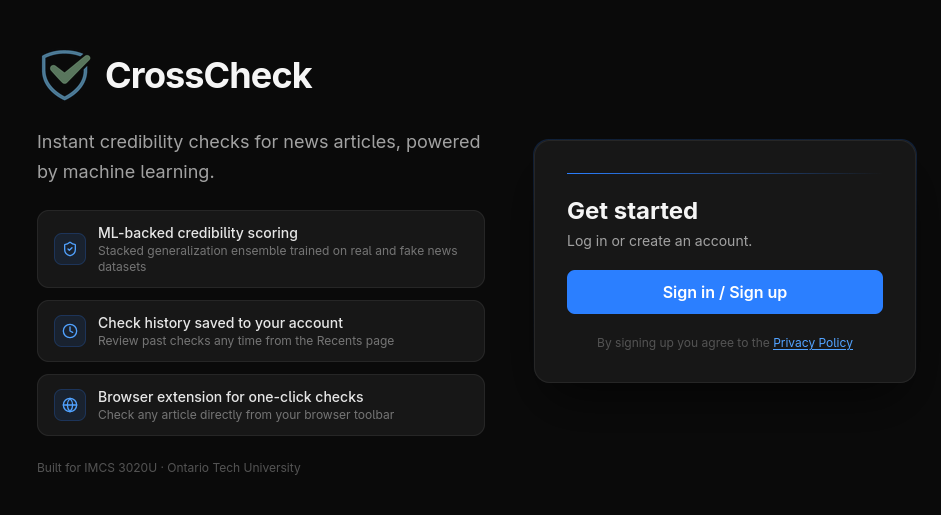
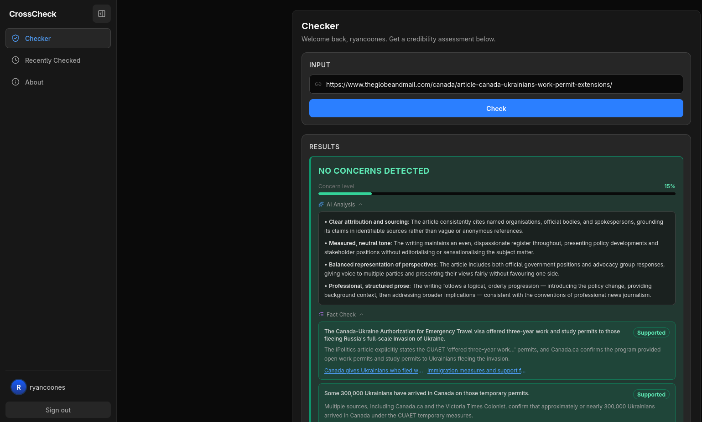
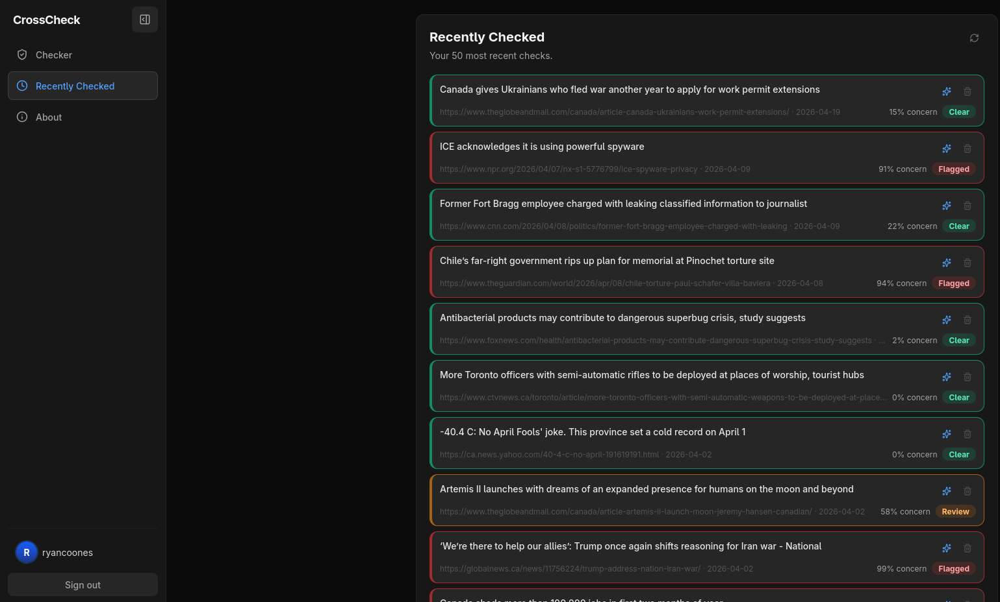
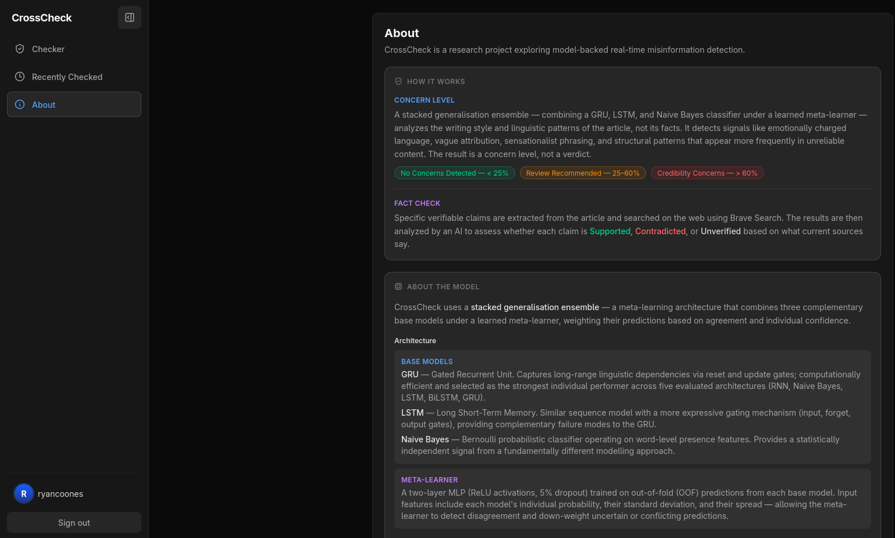
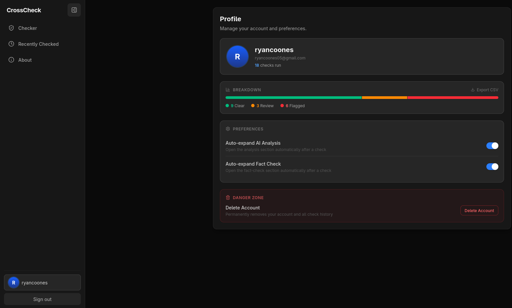

# CrossCheck

**Real-time misinformation detection.**

CrossCheck is a Chrome browser extension and companion web application that analyzes the credibility of online news articles. Using a stacked generalization ensemble of machine learning models alongside AI-powered writing analysis and automated fact-checking, CrossCheck gives users a credibility score and transparent reasoning behind it --- all in real time.

> ⚠️ CrossCheck is no longer being hosted. Our free credit on Railway and AWS ran out. The code remains available for anyone interested in running it locally.

---

## Table of Contents

- [About the Project](#about-the-project)
- [Features](#features)
- [Tech Stack](#tech-stack)
- [Screenshots](#screenshots)
- [How It Works](#how-it-works)
- [Local Setup](#local-setup)

---

## About the Project

CrossCheck was built as the final project for IMCS 3020U at Ontario Tech University. The goal was to explore whether machine learning could reliably identify misinformation online, and to package that capability into a tool that everyday users could actually benefit from.

We trained and compared five classification models (Bernoulli Naive Bayes, RNN, LSTM, BiLSTM, GRU) on the WELFake dataset, then combined the strongest performers into a stacked generalization ensemble powered by an MLP meta-learner. The final system reaches **99.09% accuracy** on the test set with well-calibrated probability scores.

## Features

- **Browser extension** — Click a button to instantly analyze the article you're currently reading.
- **Credibility score** — A probability-based rating of how likely an article is to contain misinformation.
- **AI writing analysis** — Claude (via AWS Bedrock) evaluates writing style, tone, and potential red flags.
- **Automated fact-checking** — Extracts verifiable claims from the article and checks them against live web sources using the Brave Search API.
- **History tracking** — Review your previously analyzed articles and their verdicts.
- **Companion web app** — A full dashboard for deeper analysis, persistent history, and account management.

## Tech Stack

**Frontend**
- React + Node.js (web app)
- Chrome Extension Manifest V3
- Hosted on Vercel

**Backend**
- FastAPI (Python)
- Hosted on Railway
- PyTorch for model inference
- trafilatura / newspaper4k for article extraction

**Machine Learning**
- Ensemble: GRU + LSTM + Bernoulli Naive Bayes -> MLP meta-learner
- Trained on the WELFake dataset (72,134 articles)

**AI & External Services**
- AWS Bedrock (Claude) for writing-style analysis
- AWS Lambda for claim extraction and verdict synthesis
- Brave Search API for live fact-checking
- AWS RDS for persistent storage

---

## Screenshots

### Landing Page

The entry point to CrossCheck --- introduces the tool and its capabilities.

<p align="center"></p>

### Checker Page

Paste a URL to see the full credibility analysis.

<p align="center"></p>

### History Page

Browse previously analyzed articles and their verdicts.

<p align="center"></p>

### About Page

Learn about the project, and the models behind the scenes.

<p align="center"></p>

### Profile Page

Manage your account and view your personal usage statistics.

<p align="center"></p>

---

## How It Works

1. **URL Input** — The extension captures the URL of the current tab and sends it to the backend API.
2. **Article Extraction** — The server extracts article text using trafilatura (with newspaper4k as a fallback).
3. **Text Preprocessing** — Text is normalized, tokenized, mapped to a 10,000-word vocabulary, and converted to a PyTorch tensor.
4. **Ensemble Classification** — Three base models (GRU, LSTM, Naive Bayes) each produce a probability score. These feed into an MLP meta-learner that outputs the final real/fake label.
5. **Parallel Post-Processing**
   - AWS Bedrock runs Claude to generate a writing-style analysis.
   - AWS Lambda invokes Claude to extract claims, searches them via the Brave Search API, and synthesizes per-claim verdicts (supported / contradicted / unverified).
6. **Response Assembly** — Classification, AI analysis, and fact-check verdicts are stored in AWS RDS.
7. **Display** — The extension shows the credibility score immediately; the web app retrieves the full result for detailed viewing.

---

## Local Setup

### Prerequisites

- Python 3.10+
- Node.js 18+
- A Brave Search API key
- AWS credentials (for Bedrock, Lambda, and RDS)

### Backend

```bash
cd backend
pip install -r requirements.txt
uvicorn main:app --reload
```

### Web App

```bash
cd crosscheck
npm install
npm run dev
```

### Extension

1. Open `chrome://extensions` in Chrome.
2. Enable **Developer mode**.
3. Click **Load unpacked** and select the `extension/` folder.

